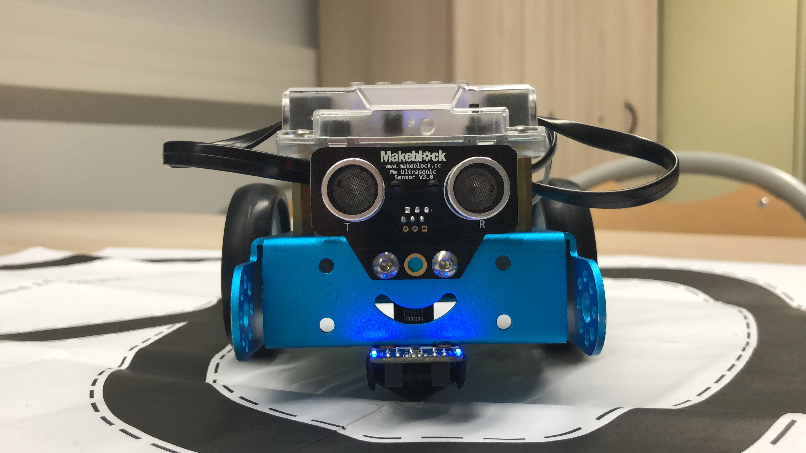

# mBot challenges

🤖 Engineering class challenges using mBot robots

- [🌈 How they work](#-how-they-work)
- [🔌 Hardware setup](#-hardware-setup)
- [⌨ Software setup](#-software-setup)
- [📝 Credits](#-credits)
- [🔐 License](#-license)

## 🌈 How they work

These scripts are various challenges our teacher gave us in order to discover Arduino programming using [mBot robots](https://www.makeblock.com/mbot). Challenges 2 and 3 are pretty simple; The level is risen with the challenge 5 and, in a near future, the final challenge.

This is not a sort of ellaborated code, as it's a beginner level : besides, I feel really comfortable writing all of that. Nevertheless, I wanted to post this on my GitHub profile and more precisely in this repository, as it's a full school project (and it brings free commits, that's so good for my graph 😁).

## 🔌 Hardware setup

You must have a [mBot robot](https://www.makeblock.com/mbot) at home, and at least two motors and a line follower connected to it if you want to try the fifth challenge.

> This is our robot... cute no?

## ⌨ Software setup

Get the [Arduino IDE](https://www.arduino.cc/en/Main/Software), open scripts inside and download them on the robot. It's as simple ! You can of course modify them at your convenience in order to match your wishes.

## 📝 Credits

- Maintainer : [Exybore](https://github.com/exybore)
- In collaboration with my classmates

## 🔐 License

        DO WHAT THE FUCK YOU WANT TO PUBLIC LICENSE
                    Version 2, December 2004

Copyright (C) 2004 Sam Hocevar <sam@hocevar.net>

Everyone is permitted to copy and distribute verbatim or modified
copies of this license document, and changing it is allowed as long
as the name is changed.

            DO WHAT THE FUCK YOU WANT TO PUBLIC LICENSE

TERMS AND CONDITIONS FOR COPYING, DISTRIBUTION AND MODIFICATION

0. You just DO WHAT THE FUCK YOU WANT TO.
