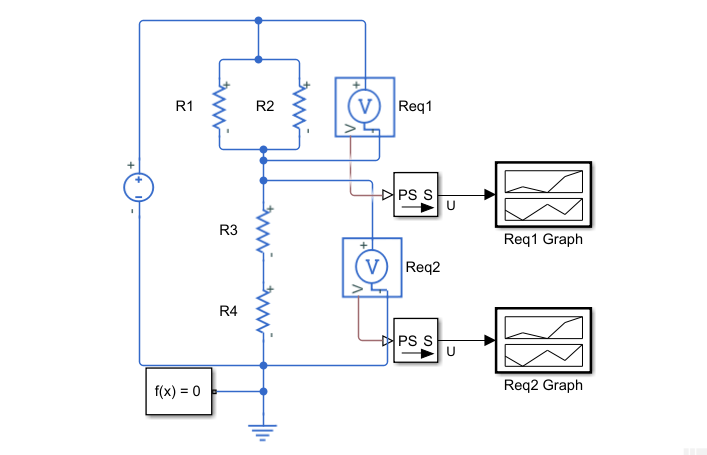

# Voltage divider

🔌 An example of a voltage divider, using Simscape and Simulink

## How it works

It's a simple electronic circuit made of a 12V voltage source, two parallel resistors and two series resistors. Values of the resistors have been calculated so every equivalent resistance has a 6V voltage :

- R1 = R2
- R3 = R4
- R1 = 4\*R3

Voltage sensors and multiplot graphs have been placed to check if there are correct voltages in both equivalent resistances.

## Setup

To run this simulation, open the [model.slx](./model.slx) file into Simulink. Make sure you have Simscape installed.

Then, simply press the `Run` button. Two windows will pop up : they're the two graphs. If you want to use the Simulation Data Inspector, simply log the two `U` (tension) signals.
